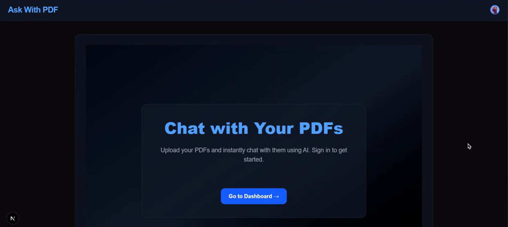
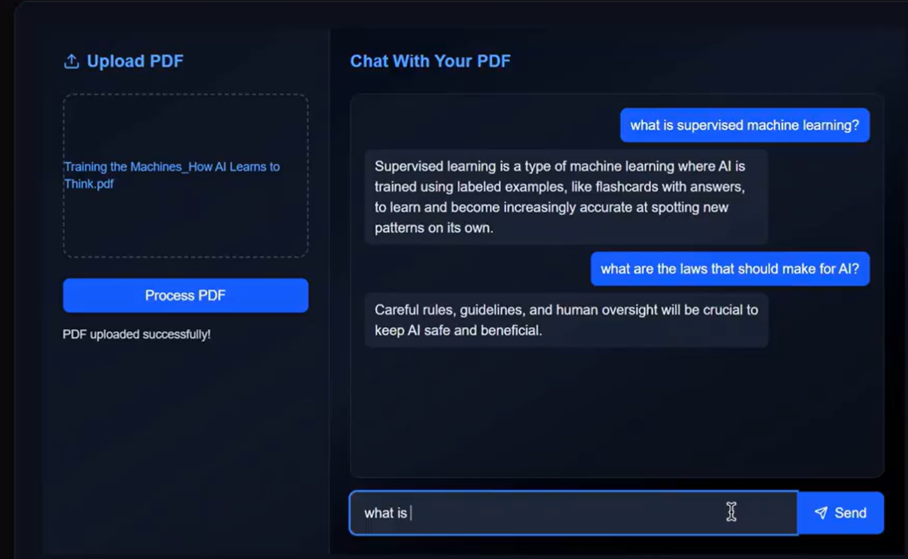

<div align="center">

# 📄 Chat With PDF

### *A RAG-powered app to chat with your PDF documents*


[]()
[]()
[]()
[]()
[]()

</div>

---

## 📝 Project Overview

**Chat With PDF** is a simple and efficient **Retrieval-Augmented Generation (RAG)** web application that allows users to:

➡️ Upload a PDF
➡️ Ask questions about its content
➡️ Get accurate, context-aware answers

Built as part of the **30 Days Learning Challenge by Learning Utsav**.

---

## 🚀 Tech Stack

### 🔹 Frontend

* ⚛️ **Next.js**
* 🔗 **Axios** (API communication)
* 🔐 **Clerk** (Authentication)

Without login, the user cannot chat.

### 🔹 Backend

* ⚙️ **FastAPI**
* 🧠 **ChromaDB** (Vector Database)
* ✨ **Embeddings** (Semantic Search)

### 🔹 Tools Used

* 🛠️ **Postman** (API testing)
* 💻 **VS Code**

---

## 🎯 Features

* 📤 Upload PDF documents
* 💬 Ask natural language questions
* 🔍 RAG-based context retrieval
* ⚡ Extremely fast backend using FastAPI
* 🧹 Auto text extraction + chunking
* 🔄 Realtime question answering
* 🎨 Clean and modern UI
* 🔐 Authentication with Clerk

---

## 🧠 How RAG Works (Simplified)

1. User uploads a PDF
2. PDF text is extracted
3. Text is chunked
4. Embeddings are generated
5. Embeddings stored in **ChromaDB**
6. User asks a question
7. Similar chunks retrieved
8. LLM generates final answer using the retrieved context

---

# Project Structure & Installation Guide

## 📁 Project Structure

```
frontend/
├── components/
├── pages/
├── styles/
└── utils/

backend/
├── main.py
├── services/
├── embeddings/
└── database/
```

---

## 🔧 Installation & Setup

### ◼ Backend (FastAPI)

```bash
cd backend
pip install -r requirements.txt
uvicorn main:app --reload
```

### ◼ Frontend (Next.js)

```bash
cd frontend
npm install
npm run dev
```

---

## 📌 Additional Project Structure (Detailed)

### Backend

```
backend/
├── app/
├── myenv/
├── pdf_chroma_db/
├── upload/
├── .env
├── requirements.txt
├── test.py
└── Demo_Images/
```

### Frontend

```
frontend/
├── .next/
├── node_modules/
├── public/
├── src/
│   ├── components/
│   ├── pages/
│   ├── utils/
│   └── styles/
├── .env
├── .gitignore
├── eslint.config.mjs
├── jsconfig.json
├── next.config.mjs
├── package-lock.json
├── package.json
├── postcss.config.mjs
└── README.md
```

---

## 🖼️ Project Demo Images




